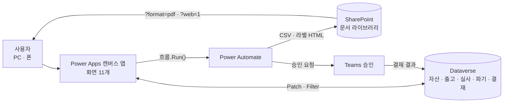

# 사내 자산관리 시스템 — Power Apps · Dataverse · Power Automate

자산 등록부터 출고, 재고실사, 파기 결재까지 **자산의 전 생애를 다루는 사내 업무 앱**이다.
검수 피드백 **14장·40건**을 받아 요구마다 원인을 찾고, 설계를 정하고, 게시본으로 검증해 반영했다.

| | |
|---|---|
| 기간 | 현 직장 재직 중(2025.11 ~) 담당 · 검수 피드백 반영 2026.09 |
| 역할 | 담당 개발자(단독) — 기능 설계·구현, Dataverse 스키마·보안 역할 변경, Power Automate 흐름, 게시 검증 |
| 범위 | 기존 앱(화면 골격)에 기능 추가·개선. 공용 헤더 컴포넌트 라이브러리는 다른 팀 것이라 제외 |
| 기술 | Power Apps 캔버스(Power Fx) · Dataverse · Power Automate · SharePoint · Teams 승인 · `pac` CLI |

> 회사 업무로 만든 앱이라 **회사·고객·실무자 이름, 실제 데이터, 환경 ID는 모두 자리표시자로 바꿨다.**
> 수식과 설계, 겪은 문제는 원문 그대로다. 게시자 접두어(`tsk_`, `cr5f6_`)는 회사를 특정하지 못해 두었다.

---

## 구성

| 홈 타일 | 화면 | 하는 일 |
|---|---|---|
| 자산등록/조회/수정 | `scrAsset` · `scrAssetDetail` | 검색·정렬·페이지, CSV 일괄등록, 상세 필수 입력 |
| 바코드 출력 | `scrBarcodePrint` · `scrLabelPrint` | Code128 라벨 → PDF (라벨 1개 = 1페이지) |
| 자산출고/이관 | `scrAssetOut` | 출고·부서 간 이관, 인수부서 조직도 선택 |
| 자산재고검사 | `scrStockTakeDept` | 부서 실사, 바코드 CSV 업로드로 보유/미보유 판정 |
| 자산파기 | `scrDisposalRequest` | 조직 범위 검색, 회계연도 잔존가 계산, 파기 신청 |
| 자산파기 승인 | `scrDisposalApprove` | 만료 건 즉시 승인, 미만료 건 **Teams 전자결재** 상신 |
| 통계·리포트 | `scrReport` | 조직 위치(부서장·팀) 기준 집계 |
| 총무 자산관리 | `scrStockTakeAdmin` | 조직도 패널, 미보유 건 처리방안 확정 |

---

## 대표 문제 5가지

### 1. 라벨 프린터 출력 — Power Fx로 바코드를 직접 그려 PDF로

**문제** 화면을 통째로 `Print()`하던 구조라 라벨이 많으면 잘리고, 롤 라벨 프린터(라벨 한 칸 = 한 장)에 맞지 않았다.

**해결** Power Fx 안에서 **Code128 인코더를 구현**해 SVG 막대를 그린 라벨 HTML을 만들고,
흐름이 SharePoint에 저장하면 앱이 `?format=pdf` 주소를 연다.
Power Fx에는 문자→코드 함수가 없어 `Find(문자, 문자표) - 1`로 코드 값을 구했고, 체크섬은 `Mod(104 + Σ i×값, 103)`.
흐름 안에서 PDF로 바꾸는 방법은 302 리다이렉트로 실패해서 버렸다.

**검증** 같은 로직의 JS 인코더를 따로 만들어 **JsBarcode와 비트 단위로 대조**(5개 입력 일치),
앱이 실제로 만든 HTML에서 SVG를 풀어 다시 대조(2건 일치). PDF는 라벨마다 1페이지, 전부 벡터.

→ [`features/barcode-label-print`](features/barcode-label-print/README.md)

### 2. CSV 일괄 업로드 — 파일을 못 읽는 Power Fx에서

**문제** 캔버스 앱은 첨부 파일 내용을 텍스트로 읽지 못한다. Dataverse 양식에는 첨부 컨트롤도 나오지 않는다.

**해결** 첨부 컨트롤은 SharePoint 목록 양식에서 빌려 오고, 흐름이 파일을 UTF-8 텍스트로만 바꿔 준다.
파싱·검증은 Power Fx에서 **헤더 이름 기준**으로 하고, 유효 행만 `ForAll` + `Patch`,
결과는 `등록 n건 / 실패 m건`과 행별 사유로 돌려준다.

**결과** 신규 생성형(자산등록)과 기존 갱신형(재고실사) 두 번 만든 뒤 **재사용 키트로 떼어냈다.**

→ [`features/csv-upload`](features/csv-upload/README.md) · [`features/stocktake-dept-csv`](features/stocktake-dept-csv/README.md)

### 3. 조직 권한 범위 — "부서장은 자기 팀만"

**문제** 부서 필터가 자유 텍스트라 권한 개념이 없었다. 부서장이 다른 부서를, 팀원이 전사를 볼 수 있었다.

**해결** 로그인 사용자의 **Dataverse 사업부 위치**를 권한으로 삼았다.
루트면 전사, 부서 사업부면 자기 부서 + 하위 팀, 팀이면 자기 팀만 고를 수 있다.
통계·총무·파기 신청 세 화면이 같은 규칙을 쓴다.

**함정** 필터는 자산의 보유부서 텍스트가 사업부 이름과 **정확히 같을 때만** 잡힌다.
"부서를 눌러도 자산이 안 나온다"는 제보를 추적해 보니 16건 중 12건이 조직도 밖 부서명이었다 — 데이터부터 맞췄다.

→ [`features/report-org-scope`](features/report-org-scope/README.md) · [`features/org-dept-data-alignment`](features/org-dept-data-alignment/README.md)

### 4. 전자결재 연동 — 결재 주체는 앱이 아니라 흐름

**문제** 파기 승인을 사내 전자결재에 태워야 했다.

**해결** 앱은 기안·결재선을 만들고 흐름을 부른다. **Teams 승인 카드를 보내고 결과를 기록하는 것은 흐름**,
결과를 파기 신청과 자산 상태에 되돌리는 것은 앱(화면 진입 시)이다.
기안 상태는 텍스트 열이 아니라 **결재선 행들로 계산**한다.

→ [`features/esign`](features/esign/README.md)

### 5. 전체 재검증에서 잡은 결함 — 영구 자산이 결재 없이 파기될 수 있었다

**문제** 14장을 다 반영한 뒤 게시본 소스를 요구와 1:1로 다시 대조했다.
파기 승인 화면은 화면을 열 때 새 규칙(4/1 회계연도, 영구 자산 = 99년)으로 계산하는데,
**처리 버튼 2개가 목록을 다시 만들 때는 옛 식**을 쓰고 있었다.
버튼을 누른 직후 영구 자산이 0년 = "만료"로 보여, 다시 누르면 **전자결재 없이 파기완료**될 수 있었다.

**해결** 같은 식이 화면에 세 벌 있다는 것을 README 함정으로 남기고 두 버튼을 맞췄다.
게시 후 소스 diff로 **바뀐 곳이 그 4줄뿐**인지 확인했다.

→ [`features/disposal-approve-paging`](features/disposal-approve-paging/README.md)

---

## 일하는 방식

- **검수 피드백부터 판정했다.** 40건을 게시본 소스와 대조해 이미 있음 13 · 부분 7 · 없음 18 · 앱 외 2로 나누고,
  "구현 안 됨" 지적 중 실제로는 데이터 문제였던 것(부서명 불일치로 0건 표시)을 따로 짚었다. 공수는 21인일로 산정
- **검증은 게시본으로 한다.** `pac canvas download`로 받은 소스를 grep·diff해 "저장했다"가 아니라 "게시됐다"를 확인한다
- **되돌릴 길을 먼저 만든다.** 데이터를 지우고 다시 넣는 작업은 넣는 쪽부터 성공시키고, 원래 값은 파일로 백업한다
- **요구 범위만 고친다.** 작업 중 보인 곁가지 개선은 따로 적고 손대지 않았다

---

## 저장소 구조

각 폴더는 **README(요구·결정·함정·확인한 것) + 게시본에서 옮긴 수식 + 붙여넣을 컨트롤 YAML**로 되어 있다.

| 영역 | 폴더 |
|---|---|
| 자산 목록·등록 | [`asset-list-paging-sort`](features/asset-list-paging-sort/README.md) · [`asset-detail-required`](features/asset-detail-required/README.md) · [`asset-bulk-register`](features/asset-bulk-register/README.md) · [`asset-appendto-permission`](features/asset-appendto-permission/README.md) |
| 바코드 | [`barcode-label-print`](features/barcode-label-print/README.md) · [`barcode-home-button`](features/barcode-home-button/README.md) |
| 출고 | [`asset-out-receive-dept`](features/asset-out-receive-dept/README.md) |
| 재고실사 | [`stocktake-dept-csv`](features/stocktake-dept-csv/README.md) · [`stocktake-admin-org-panel`](features/stocktake-admin-org-panel/README.md) |
| 파기·결재 | [`disposal-search-panel`](features/disposal-search-panel/README.md) · [`disposal-approve-paging`](features/disposal-approve-paging/README.md) · [`esign`](features/esign/README.md) |
| 통계·조직 | [`report-org-scope`](features/report-org-scope/README.md) · [`org-dept-data-alignment`](features/org-dept-data-alignment/README.md) · [`header-nav`](features/header-nav/README.md) |
| 재사용 키트 | [`csv-upload`](features/csv-upload/README.md) · [`excel-export`](features/excel-export/README.md) |
| 전자결재 앱 (별도 앱) | [`esign-app-mobile`](features/esign-app-mobile/README.md) · [`esign-approval-line`](features/esign-approval-line/README.md) · [`search-date-range`](features/search-date-range/README.md) · [`draft-date-on-submit`](features/draft-date-on-submit/README.md) |

앱 소스 전체(`*.pa.yaml`)는 Studio가 만드는 덤프이고 환경 정보가 섞여 있어 올리지 않았다.
여기 있는 것은 **직접 만든 부분만 게시본에서 떼어낸 것**이다.
